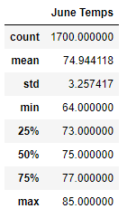
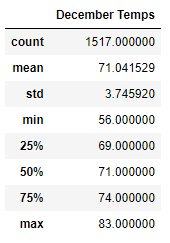

# surfs_up
# Overview

The purpose of our analysis is to see how is the weather in the island of Oahu Hawaii and figure out if opening a shop called 'Surf n Shake' will be sustainable year around. The shop would sell icecream and rent surfboards. 

## Purpose
For analyzing this we will be using a sqllite database which had 7 stations data on the weather changes over multiple years. We will be analyzing the June and December months 
- general statistic of both months.
- for each station
- for different years

# Results
## June and December Temperature analysis
The temperature analysis is based on the weather data collected from nine different stations from the year 2010 to 2017. 
Here is comparison of June and December Statistics.

          

**Analysis Derived**
* Data points for December is less compared to June month.
* Max temperature difference between June to December is hardly **2** degrees where as Min temperature difference between June and December is **8** degrees 
* The average temperature for June is **74.94** whereas for December is **71.04**. There is hardly **3** degree of difference between both the averages.
* The percentiles 25%, 50%, 75% run pretty close for June month. where as for December it is little distinct.
* Standard Deviation for both the months are very close and hardly difference of **.49**

**Conclusion** - The above analysis concludes that as there is not much variations in the temperature over 6 months the weather is very much favorable for the shop to sustain.
