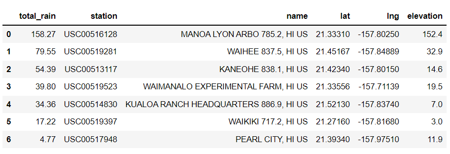

# surfs_up
# Overview

The purpose of our analysis is to see how is the weather in the island of Oahu Hawaii and figure out if opening a shop called 'Surf n Shake' will be sustainable year around. The shop would sell icecream and rent surfboards. 

## Purpose
For analyzing this we will be using a sqllite database which had 7 stations data on the weather changes over multiple years. We will be analyzing the June and December months 
- general statistic of both months.
- for each station
- for different years

# Results
## 1) June and December Temperature analysis
The temperature analysis is based on the weather data collected from nine different stations from the year 2010 to 2017. 
Here is comparison of June and December Statistics.

<p align="center">          </p>

**Analysis Derived**
* Data points for December is less compared to June month.
* Max temperature difference between June to December is hardly **2** degrees where as Min temperature difference between June and December is **8** degrees 
* The average temperature for June is **74.94** whereas for December is **71.04**. There is hardly **3** degree of difference between both the averages.
* The percentiles 25%, 50%, 75% run pretty close for June month. where as for December it is little distinct.
* Standard Deviation for both the months are very close and hardly difference of **.49**

**Conclusion** - The above analysis concludes that as there is not much variations in the temperature over 6 months the weather is very much favorable for the shop to sustain.

## 2) June and December Year wise averages
As part of additional data analysis on June and December, I created two functions to get June and December month temperatures for 7 years.
This helps in comparing and understanding in fluctions of weather in June and December month. 
Below images shows the June and December month data year wise.

<p align="center"> </p>

Functions used to fetch above data
```python
# This function called `calc_temps` will accept start date and end date in the format '%Y-%m-%d' 
# and return the minimum, average, and maximum temperatures for that range of dates
def calc_temps(start_date, end_date):
        
    return session.query(func.min(Measurement.tobs), func.avg(Measurement.tobs), func.max(Measurement.tobs)).\
        filter(Measurement.date >= start_date).filter(Measurement.date <= end_date).all()

```

```python
# This function is to display data for 7 years
def displayMoreInfo(month):
    year=['2010', '2011', '2012', '2013', '2014', '2015', '2016']

    print('\033[1m' + 'Year   Min    Avg       Max ' + '\033[0m')
    print('-----------------------------')
    for yr in year:
        start_date = yr + '-' + month + '-01'
        end_date = yr + '-' + month + '-30'


        result = calc_temps(start_date, end_date) #Calling temperature fetch for date range
        print(f'{yr}   {result[0][0]}   {np.round(result[0][1],2)}     {result[0][2]} ')
```

```python
# Calling display function
print('\033[1m' + 'June Temperatures for 7 years' + '\033[0m')
print(' ')
displayMoreInfo('06')

```

This analysis concludes that the average weather temperatures are around 74 degrees in June month and around 71 degrees in December every year.
Also the min and max does not fluctuate too much so that helps to predict that temperatures are great for opening the shop. That ensures that it is safe to open the shop and also there are high chances to have more surfers visiting these stations.

## 3) June and December Station wise averages
As part of additional data analysis on June and December, I created two functions to get June and December month temperatures for 7 years.
This helps in comparing and understanding in fluctions of weather in June and December montn for each Station. So that will decide if the shop opening be avoided at any station.
Below images shows the June and December month data year wise.

<p align="center"> </p>

- to check all the station data for June - [Click here](Images/June Temperatures for different stations.png)
- to check all the station data for December - [Click here](Images/Dec Temperatures for different stations.png)
- 
Functions used to fetch above data
```python
# This function called `calc_temps_StationWise` will accept start date and end date STATION WISE in the format '%Y-%m-%d' 
# and return the minimum, average, and maximum temperatures for that range of dates
def calc_temps_StationWise(start_date, end_date):
    return session.query(Measurement.station, func.min(Measurement.tobs), func.avg(Measurement.tobs), func.max(Measurement.tobs)).\
                group_by(Measurement.station).order_by(func.count(Measurement.station).desc()).\
                filter(Measurement.date >= start_date).filter(Measurement.date <= end_date).all()
    
```

```python
# This function is to display data for 7 years
def displayMoreInfoStationWise(month):
    
    year=['2010', '2011', '2012', '2013', '2014', '2015', '2016']

    print('\033[1m' + 'StationID     Min       Avg       Max ' + '\033[0m')
    print('---------------------------------------')
    for yr in year:
        start_date = yr + '-' + month + '-01'
        end_date = yr + '-' + month + '-30'
        print('\033[1m' + f'------------Year-{yr}------------------' + '\033[0m')
        print("   ")
        resultList = calc_temps_StationWise(start_date, end_date)
        
        for result in resultList:
            
            print(f'{result[0]}   {result[1]}      {np.round(result[2],2)}     {result[3]}')
        print("  ")

```

```python
# Calling display function
print('\033[1m' + 'June Temperaturesfor different stations' + '\033[0m')
print(' ')
displayMoreInfoStationWise('06')

```

The analysis concludes that there is little fluctions on temperatures for each station in each year, however the avergage across the years and for each station is pretty much similar and it is around 72 to 77 degress. That ensures that it is safe to open the shop and also there are high chances to have more surfers visiting these stations.

## 4) Precepitation Analysis for each Station

Here we also fetched the Precepitation data, to find how much rainfall happens at each Station.

<p align="center"> </p> 


# Resources
### Software
1) Python
2) Sqllite
3) Jupyter Notebook
4) VS Code

### Libraries
1) SqlAlchemy
2) Datetime
3) Numpy
4) Pandas
